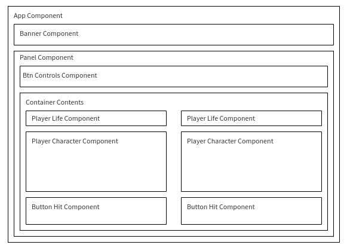
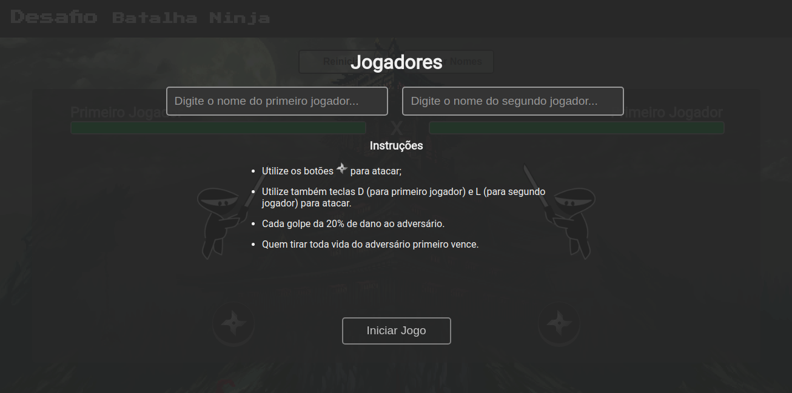
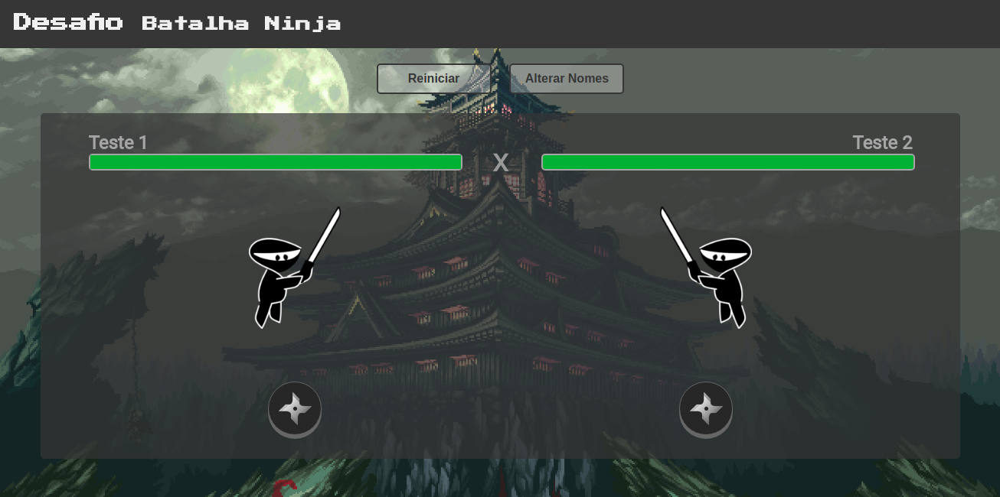
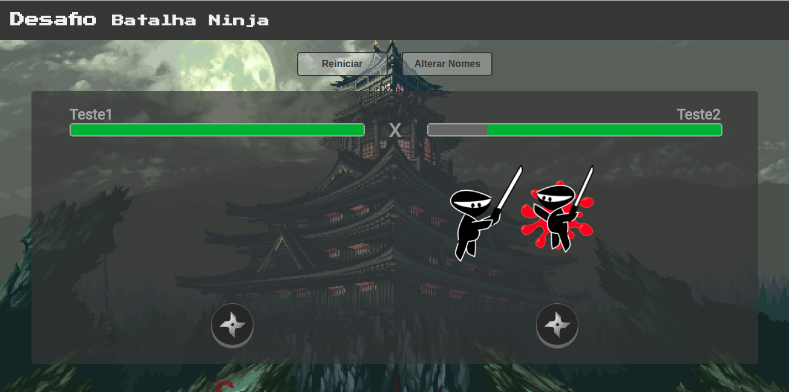
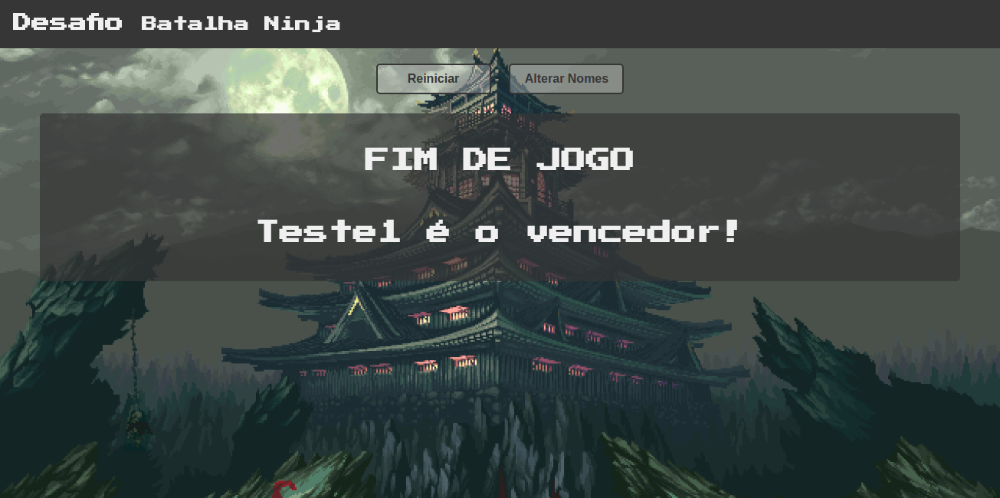

## DESAFIO
 
<h2>O projeto foi desenvolvido em Angular 4 seguindo as regras do mock como pré-requisitos.</h2>
 

<h2>O projeto segue a estrutura base conforme a imagem abaixo:</h2>
    

<h3>A aplicação está hospedada no serviço S3 da Amazon e pode ser acessada pelo link:
    <a href="http://desafio-batalha-ninja.s3-website-sa-east-1.amazonaws.com/">link</a>
</h3>

<h2>Instruções do Jogo</h2>
<ul>
    <li>Utilize os botões
         para atacar;</li>
    <li>Utilize também teclas D (para primeiro jogador) e L (para segundo jogador) para atacar.</li>
    <li>Cada golpe da 20% de dano ao adversário.</li>
    <li>Quem tirar toda vida do adversário primeiro vence.</li>
</ul>

<h2>Telas do Projeto</h2>

<h4>Desenvolvido por 
    <a href="https://leodionizio.github.io" target="_blank">Leonardo Dionizio</a>
</h4>
